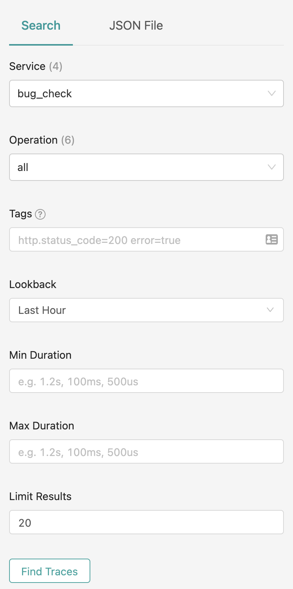
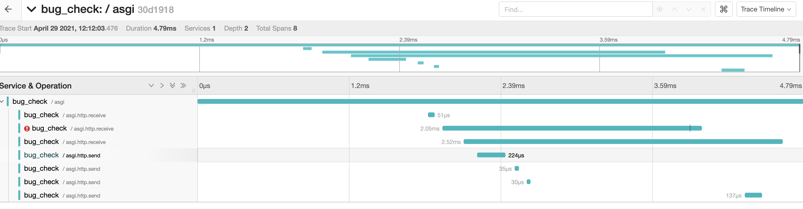
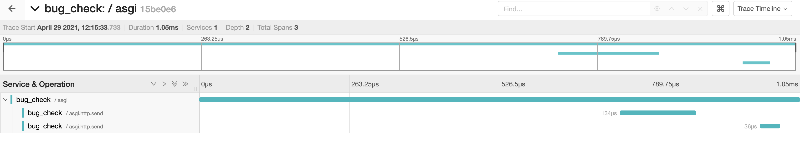

To run this, you will need a jaeger instance:

```
docker run -d --name jaeger \
  -e COLLECTOR_ZIPKIN_HTTP_PORT=9411 \
  -p 5775:5775/udp \
  -p 6831:6831/udp \
  -p 6832:6832/udp \
  -p 5778:5778 \
  -p 16686:16686 \
  -p 14268:14268 \
  -p 14250:14250 \
  -p 9411:9411 \
  jaegertracing/all-in-one:1.21
```

Install requirements:

```
pip install -r requirements.txt
```

After that, just run:

```
uvicorn main:app
```

And visit `localhost:8000`

This should generate a trace in jaeger. Go to `localhost:16686`, select `bug_check` from the service dropdown and click `find traces`.



If you run the project as is, you will see a trace with an error:


If you comment out one of the middlewares, you will still see more spans, but no error. If you comment out all of them, or move the instrumentation to the top, no errors will happen:


